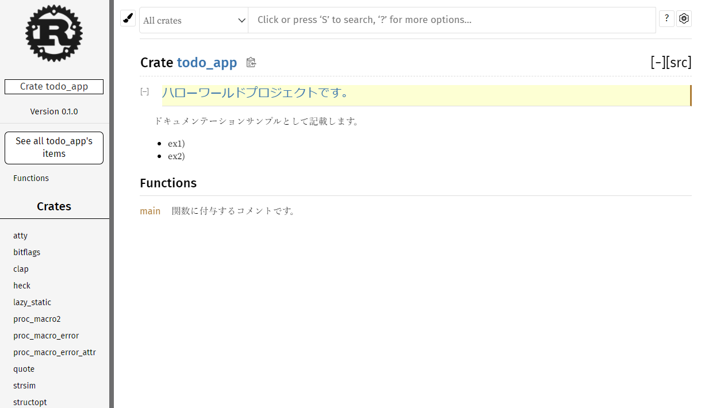

# Rust 学習ノート

## コーディング

- Rust で変数はデフォルトで不変、Java のような final は不要です。
  - 逆に、可変にする場合は`mut`を利用し、`let mut a = String::new();`のように宣言します。
- 代入操作はムーブとなるため、参照するとコンパイルエラーが発生する。

**ダメな例**

```rust
let mut a = vec![1, 2, 3];
let mut b = a; // 所有権がaからbに移動
a[0] = 2; // ここでエラー
```

**良い例**

```rust
let mut a = vec![1, 2, 3];
let mut b = a.clone(); // aのクローンを作成
a[0] = 2; // エラーが発生しない
```

- シャドウイング。既に宣言した変数に対して、再度変数名を再利用することが可能。型変換を行う際などに利用されます。。

```rust
let mut guess = String::new();
io::stdin()
    .read_line(&mut guess)
    .expect("Failed to read line");
let guess: u32 = guess.trim().parse().expect("Please type a number!");
```

- [mutch 演算子](https://doc.rust-jp.rs/book-ja/ch06-02-match.html)は、switch のような使い方が可能です。全パターンの網羅をする必要が有り、ワイルドカード(\_)も利用可能です。

```rust
match guess.cmp(&secret_number) {
    Ordering::Less => println!("Too small!"),
    Ordering::Greater => println!("Too big!"),
    Ordering::Equal => {
        println!("You win!");
        break;
    }
}
```

- mutch によるパターンマッチング例です。以下の例では、parse の返り値`Result`型は、Ok もしくは Err の列挙型を返却します。Ok の場合の引数を guess に u32 型として返却します。Err の場合は continue（ループの中で利用してる体）を明示してます。

```rust
let guess: u32 = match guess.trim().parse() {
    Ok(num) => num,
    Err(_) => continue,
};
```

- エラーハンドリングは、`Result`型や`Option`型の Enum を利用します。
  - `Result`は、失敗するかもしれない処理を表現します。
  - `Option`は、取得できないかもしれない値を表現します。

```rust
pub enum Result<T, E> {
    Ok(T),
    Err(E),
}

pub enum Option<T> {
    None,
    Some(T),
}
```

- Rust における[クロージャ](https://doc.rust-jp.rs/rust-by-example-ja/fn/closures.html)は、外側の環境を補足した関数のことです。元々クロージャの説明は、以下のようなものをよく目にします。

  - 関数が定義された時点での環境を保存しておき、関数の実行時に再利用できる構造。
  - 自関数の外のスコープ変数を操作するインナー関数。
  - 大雑把に言えば、関数のスコープにある変数を自分が定義された環境に閉じ込めるためのデータ構造。

**JavaScript では、以下のような関数の inner 関数をクロージャと呼びます**

```js
function outer() {
  var x = 10;
  function inner() {
    alert(x);
    x = x + 1;
  }
  return inner;
}

var f = outer();

f(); // 10
f(); // 11
f(); // 12
```

**Rust では、Java で言う無名関数や lambda 式のことを指し、関数の定義とその関数からスコープ外変数を参照することを合わせてクロージャと呼ぶ**

```rust
fn main() {
    ...
    let x = 1;
    let c1 = || println!("{}", x);
    c1(); // 1
}
```

- [Rust - 1.13](https://blog.rust-lang.org/2016/11/10/Rust-1.13.html)リリースで導入された`?`演算子 は、`Result`の複雑化を防ぐために導入されました。
  - `?`演算子は、`Result`を返す関数の中でしか利用できません。
  - `?`演算子は、`Result`型の後につけることで、`Ok`なら中の値の返却、`Err`なら即座に値を return します。

**これまでの書き方では、File::open の Result と read_to_string の Result をそれぞれ Result 処理していました。**

```rust
fn read_username_from_file() -> Result<String, io::Error> {
    let f = File::open("username.txt");

    let mut f = match f {
        Ok(file) => file,
        Err(e) => return Err(e),
    };

    let mut s = String::new();

    match f.read_to_string(&mut s) {
        Ok(_) => Ok(s),
        Err(e) => Err(e),
    }
}
```

**これまでは try!マクロ記法で Result 型の際に処理を省略することが可能でした。**

```rust
fn read_username_from_file() -> Result<String, io::Error> {
    let mut f = try!(File::open("username.txt"));
    let mut s = String::new();

    try!(f.read_to_string(&mut s));

    Ok(s)
}
```

**?演算子を用いた書き方では、さらにシンタックスシュガーが可能です。**

```rust
fn read_username_from_file() -> Result<String, io::Error> {
    let mut f = File::open("username.txt")?;
    let mut s = String::new();

    f.read_to_string(&mut s)?;

    Ok(s)
}
```

- Rust における`enum`は、直和型を管理できます。直和型は、一言でいうと直積型（構造体）の列挙型です。
  - [代数的データ型](https://zenn.dev/khale/articles/java-17-tips#%E4%BB%A3%E6%95%B0%E7%9A%84%E3%83%87%E3%83%BC%E3%82%BF%E5%9E%8B)参照。

```rust
pub enum Action {
    Add { task: String },
    Done { position: usize },
    List,
}
```

- 数値型まとめ
  - `i`は符号あり整数型
  - `u`は符号なし整数型
  - アルファベットに続く数値により bit 数を確保
  - `isize`と`usize`は、動作コンピュータの種類に依存する。

| 型           | 最小値                  | 最大値                 |
| ------------ | ----------------------- | ---------------------- |
| i8           | -128                    | 127                    |
| i16          | -32768                  | 32767                  |
| i32          | -2147483648             | 2147483647             |
| i64          | -9223372036854775808    | 9223372036854775807    |
| u8           | 0                       | 255                    |
| u16          | 0                       | 65535                  |
| u32          | 0                       | 4294967295             |
| u64          | 0                       | 18446744073709551615   |
| isize(64bit) | -9223372036854775808    | 9223372036854775807    |
| usize(64bit) | 0                       | 18446744073709551615   |
| f32          | -3.4028235e38           | 3.4028235e38           |
| f64          | -1.7976931348623157e308 | 1.7976931348623157e308 |

- [ベクタ型](https://doc.rust-jp.rs/rust-by-example-ja/std/vec.html)
  - ベクタ型は、サイズを変更可能な配列。

```rust
    let collected_iterator: Vec<i32> = (0..10).collect();
    println!("Collected (0..10) into: {:?}", collected_iterator);
    // -> Collected (0..10) into: [0, 1, 2, 3, 4, 5, 6, 7, 8, 9]

    let xs = vec![1i32, 2, 3];
    println!("Initial vector: {:?}", xs);
    // -> Initial vector: [1, 2, 3]

    let mut mute_xs = vec![1i32, 2, 3];
    mute_xs.push(4);
    println!("Added vector: {:?}", mute_xs);
    // -> Added vector: [1, 2, 3, 4]
```

- [トレイト](https://doc.rust-jp.rs/book-ja/ch10-02-traits.html)（共通の振る舞いを定義する、他の言語でいうインターフェースのようなもの）により、継承先クラスで共通して利用される標準的な実装を提供できます。

- `[#derive]`アトリビュートは、構造体や列挙型に振る舞いを追加できます。

**Debug により、`{:?}`デバッグ出力フォーマットを指定可能になります。**

```rust
#[derive(Debug)]
struct Data {
    value: i32,
}
fn main() {
    let d = Data { value: 2 };
    println!("{:?}", d); // Data { value: 2 }
}
```

**PartialEq により、オブジェクトの等価判定が可能になります。**

```rust
#[derive(Debug, PartialEq)]
struct Data {
    value: i32,
}
fn main() {
    let d1 = Data { value: 2 };
    let d2 = Data { value: 2 };
    assert_eq!(d1, d2);
}
```

- `impl Struct...`により、構造体にいくつかのメソッドを追加できます。例えば、構造体のインスタンシエートルールなどを記載することができます。以下の例では、String 引数を受け取り`Task`構造体をインスタンシエートする`new`ファンクションを定義しています。

```rust
use chrono::{DateTime, Utc};

pub struct Task {
    pub text: String,
    pub created_at: DateTime<Utc>,
}

impl Task {
    pub fn new(text: String) -> Task {
        let created_at: DateTime<Utc> = Utc::now();
        Task { text, created_at }
    }
}
```

- [Rust - 1.39.0](https://blog.rust-lang.org/2019/11/07/Rust-1.39.0.html)リリースで導入された `async/await`

- ドキュメンテーションコメント
  - `//!`を利用することで、クレート・モジュール・関数単位にコメントを付与できます。一般的には、ライブラリに対する説明を付与するコメントではこちらを使います。
  - `///`を利用することで、自由にマークダウンを記載することができます。一般的には、関数に対して付与するコメントはこちらを使います。
  - `$ cargo doc`にて、target フォルダ下にクレートドキュメントが生成されます。

```rust
//! # ハローワールドプロジェクトです。
//!
//! ドキュメンテーションサンプルとして記載します。
//!
//! - ex1)
//! - ex2)

/// # 関数に付与するコメントです。
///
/// メインエントリです。
fn main() {
    println!("Hello, world!");
}

```



## パッケージ管理

- cargo によってパッケージ管理され、Cargo.toml, Cargo.lock にて依存ライブラリが記載されます。
  - 依存ライブラリは、[crates.io](https://crates.io/)にて公開されます。
  - 公開されたライブラリに対するドキュメントは、[Docs.rs](https://docs.rs/)にて公開されます。
- ビルドのタイプはバイナリ（bin）もしくはライブラリ（lib）となり、ビルドした一式のコンパイル単位をクレート（crate）と呼びます。
  - bin の場合は、`$ cargo new hello_world`もしくは`$ cargo init --bin hello_world`にてプロジェクトを作成します。
    - init の場合、引数に何も与えない場合はカレントディレクトリを root とみなします。
- Cargo.lock は、lib クレートの場合は構成管理に含めませんが、バイナリクレートの場合は構成管理に含めます。（[参考：Cargo.toml と Cargo.lock](https://doc.rust-lang.org/cargo/guide/cargo-toml-vs-cargo-lock.html)）
  - lib クレートを利用するクレートにから見た際に、利用する lib クレートでのバージョンが固定されることで、他 lib クレートとのバージョンの競合が発生する可能性が有るためです。
- 利用者のフィーチャーフラグの利用方法。
  - フィーチャーフラグとは、コードを書き換えることなく動的にシステムの振る舞いを変更することができる開発手法を指します。
  - クレート内の特定の機能の有効／無効を切り替えることが可能です。
  - クレートによってはデフォルトでいくつかのフラグが有効になっていることも有るため、`default-features = false`を指定すると無効にできます。

**Cargo.toml**

```toml
[dependencies]
actix-web = { version = "4.0.0-beta.13", default-features = false }
```

- クレート作成者のフィーチャーフラグの利用方法。
  - 自作したクレートにフィーチャーフラグを設定する場合は、以下のように toml にフィーチャーフラグを設定します。
  - 以下のような設定で、`ja`フィーチャーフラグが有効な場合とそうでない場合で、依存先のクレートでの関数の振る舞いを動的にすることができます。

**Cargo.toml**

```tomol
[features]
default = []
ja = []
```

**lib.rs**

```rust
#[cfg(not(feature="ja"))]
pub fn hello() -> &'static str {
    "hello"
}
#[cfg(feature="ja")]
pub fn hello() -> &'static str {
    "こんにちは"
}
```

- クレートのサーチ方法として、`$ cargo search`コマンドが用意されている。例として、コマンドライン引数を解析するクレートの検索を行うと以下のような結果となる。

```bash
$ cargo search structopt
structopt = "0.3.25"               # Parse command line argument by defining a struct.
structopt-yaml = "0.4.6"           # An default value loader from YAML for structopt
structopt-toml = "0.5.0"           # An default value loader from TOML for structopt
structopt-yaml-derive = "0.4.6"    # A derive crate of structopt-yaml
structopt-flags = "0.3.6"          # Collection of reusable flags for StructOpt
indigo-structopt = "0.3.21"        # Parse command line argument by defining a struct.
structopt-utilities = "0.1.0"      # Small utilities related to structopt and clap
structopt-toml-derive = "0.5.0"    # A derive crate of structopt-toml
paw-structopt = "1.0.0"            # Structopt support for the Paw crate.
ethers-structopt = "0.1.0"         # Structopt derived ethers-rs types, useful for building Ethereum CLIs
```

## トレインモデル

Rust では、コードの安全性に注意するため、リリースを以下の３バージョンに分けています。（[（参考）Nightly Rust](https://doc.rust-jp.rs/book-ja/appendix-07-nightly-rust.html)）

- Nightly
- Beta
- Stable

Nightly は毎日作られるリリースで、6 週間ごとに Beta に合流します。さらに 6 週間で、Beta が Stable に合流します。
Stable 版は、1.X の X 部分にあたるリリースとなります。

- 現時点のビルドバージョンの確認方法

```bash
$ rustup default
nightly-x86_64-pc-windows-msvc (default)
```

- デフォルトのビルドバージョンの変更方法

```bash
$ rustup default nightly
$ rustup update
```

## 豆知識

- toml の由来は、`Tom's Obvious, Minimal Language`の略です。[Tom Preston-Werner](https://twitter.com/mojombo)氏によって作成されました。GitHub の共同創業者。

## 参考

- [The Rust Programming Language](https://doc.rust-lang.org/book/ch01-02-hello-world.html#anatomy-of-a-rust-program)
- [The Rust Programming Language 日本語版](https://doc.rust-jp.rs/book-ja/title-page.html)
- [Rust Blog](https://blog.rust-lang.org/)
  - Rust のリリース情報など
- [Rust の最初のステップ](https://docs.microsoft.com/ja-jp/learn/paths/rust-first-steps/)
  - Microsoft 提供の Rust 学習コンテンツ
- [Qiita - Rust に影響を与えた言語たち](https://qiita.com/hinastory/items/e97d5459b9cda45758db)

## VScode での環境構築

- extention.json

```json
{
  "recommendations": ["matklad.rust-analyzer", "vadimcn.vscode-lldb"],
  "unwantedRecommendations": []
}
```

インストール後、`rust-analyzer`を動かすためには以下コンポーネントを追加します。

```bash
$ rustup component add rust-src
$ rustup component add rust-analysis
$ rustup component add rls
```
