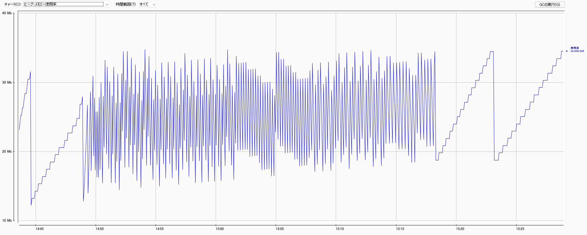

# JVM メモリ使用調査

<!-- @import "[TOC]" {cmd="toc" depthFrom=1 depthTo=6 orderedList=false} -->

<!-- code_chunk_output -->

- [JVM メモリ使用調査](#jvm-メモリ使用調査)
  - [課題](#課題)
  - [アプリで考えられる原因](#アプリで考えられる原因)
  - [現行 JVM 設定](#現行-jvm-設定)
    - [起動オプション](#起動オプション)
    - [その他指定できるオプション](#その他指定できるオプション)
    - [GC アルゴリズム](#gc-アルゴリズム)
    - [その他参考](#その他参考)
  - [調査方法](#調査方法)
    - [利用ツール](#利用ツール)
  - [調査](#調査)
    - [ローカルで実行した場合](#ローカルで実行した場合)
      - [Locust](#locust)
      - [jconsole](#jconsole)
    - [Docker コンテナ内で実行した場合](#docker-コンテナ内で実行した場合)
      - [Dockerfile に JMX 接続する設定](#dockerfile-に-jmx-接続する設定)
      - [Locust](#locust-1)
      - [jconsole](#jconsole-1)
  - [辞書, TIPS](#辞書-tips)
    - [ヒープ領域についての詳細](#ヒープ領域についての詳細)
    - [JVM でのデフォルト値](#jvm-でのデフォルト値)
    - [GC の動き](#gc-の動き)
    - [jconsole](#jconsole-2)

<!-- /code_chunk_output -->

## 課題

コンテナ上で動作する Java アプリケーションのスケールインテストにおいて、スケールインの閾値（メモリ使用率 40 パーセント）を下回らずに、メモリ使用率が収束してしまう。

## アプリで考えられる原因

基本的には、本番とローカル開発時で利用する環境の差異から考える。

- GC の本番とのアルゴリズムの差異
- 起動 Docker コンテナサイズの差異

## 現行 JVM 設定

### 起動オプション

- Xmx2048m
  - ヒープの最大サイズを指定
  - デフォルトは使用可能メモリの半分（最小 16MB, 最大 512MB）

### その他指定できるオプション

- Xms
  - ヒープの初期サイズ

### GC アルゴリズム

```sh
$ java -XX:+PrintFlagsFinal -version | egrep "Use.*GC "
     bool UseAdaptiveSizePolicyWithSystemGC        = false                                     {product} {default}
     bool UseConcMarkSweepGC                       = false                                     {product} {default}
     bool UseG1GC                                  = true                                      {product} {ergonomic}
     bool UseMaximumCompactionOnSystemGC           = true                                      {product} {default}
     bool UseParallelGC                            = false                                     {product} {default}
     bool UseParallelOldGC                         = false                                     {product} {default}
     bool UseSerialGC                              = false                                     {product} {default}
     bool UseShenandoahGC                          = false                                     {product} {default}
openjdk version "11.0.9.1" 2020-11-04
OpenJDK Runtime Environment AdoptOpenJDK (build 11.0.9.1+1)
OpenJDK 64-Bit Server VM AdoptOpenJDK (build 11.0.9.1+1, mixed mode)

```

G1GC は、以下の特徴。

- アプリケーションスレッドと並列で GC プロセスが走る、コンカレント型
- ヒープサイズが 4G 以上ある場合に適している
- Java6 では試験的実装、本格的に使うなら Java8 以降

### その他参考

- ヒープスレッドスタック及び Native ヒープと呼ばれる別のメモリもあるため、ここで指定したヒープのサイズが Java プロセスの利用メモリサイズとは限らない。

- 余談として、GC アルゴリズムを指定している箇所は以下。server_processors（起動プロセスがサーバである、つまりサーバ並みのスペックである）のサイズ定義を 2 とした時に、アクティブなプロセッサのサイズが 2 以上であれば、高スペックマシーンとみなして UseG1GC を選定される。
  - http://hg.openjdk.java.net/jdk/jdk11/file/1ddf9a99e4ad/src/hotspot/share/gc/shared/gcConfig.cpp#l103
  - http://hg.openjdk.java.net/jdk/jdk11/file/1ddf9a99e4ad/src/hotspot/share/runtime/os.cpp#l1665

## 調査方法

### 利用ツール

- jconsole
  - `$ jps`により、JVM の実行プロセスを取得
  - `$ jconsole`により、上記プロセスを取得
- Locust
  - コールする API は、hello を返すのみのシンプルな greet エンドポイントを 1 ～ 2 秒間隔の乱数で call

```py
from locust import HttpUser, between, task


class QuickStartUser(HttpUser):
    wait_time = between(1, 2)

    @task
    def hello(self):
        self.client.get("/sandbox/greet")
```

- 起動コマンド

```sh
$ locust -f locustfile.py
```

上記定義にて、 1 人から 100 人まで増やして実行する。

- Number of users
  - 100
- Spawn rate
  - 1

## 調査

### ローカルで実行した場合

- java アプリケーションの起動
  - `$ java -Xmx2048m -jar sandbox.jar`
- jconsole の起動
  - `$ jconsole`

#### Locust


#### jconsole

- 全て
  
- eden
  
- survivor
  
- old
  

- eden 領域は定期的な Copy GC が実行されている
- old 領域が高止まりしており、Full GC は実行されていない

### Docker コンテナ内で実行した場合

本番環境に合わせるサイズで実行する。

- CPU
  - 0.5vCPU
- memory
  - 1GB

#### Dockerfile に JMX 接続する設定

既存の java アプリケーションが起動する Docker ファイルに、以下設定を追加する。

- jmxremote の接続設定
  - 5000 ポートで接続
  - 対象 host をローカルホストに
  - ssl, 認証を不要とする

```Dockerfile
ENV JAVA_TOOL_OPTIONS "-Dcom.sun.management.jmxremote.ssl=false \
 -Dcom.sun.management.jmxremote.authenticate=false \
 -Dcom.sun.management.jmxremote.port=5000 \
 -Dcom.sun.management.jmxremote.rmi.port=5000 \
 -Dcom.sun.management.jmxremote.host=0.0.0.0 \
 -Djava.rmi.server.hostname=0.0.0.0"

EXPOSE 5000
```

- java アプリケーションの起動

  - `$ docker build -f ./docker-sandbox/Dockerfile_Sandbox ./ -t sandbox`
  - `$ docker run --rm --memory=1g -p 9999:9999 --name=sandbox sandbox`

#### Locust


#### jconsole

- 全て
  
- eden
  
- survivor
  
- tenured
  

## 辞書, TIPS

### ヒープ領域についての詳細

- Old
  - Old 領域は、長期間使用されたオブジェクトが格納される
- Young-Eden
  - Young 領域の Eden は、生成されたばかりのオブジェクトが格納される。
- Young-Survivor
  - Young 領域の Survivor は、ある程度の間使用されているオブジェクトが格納される。

### JVM でのデフォルト値

NewRatio オプションにて Old と Young のサイズ比率を指定可能。
NewRatio を 2 とすると、`Young : Old = 1 : 2`のサイズ比となる。
デフォルト値は 2。

### GC の動き

- 新規オブジェクトはまず、Eden に格納される。
- Eden がいっぱいになると、Copy GC が発生する。
  - Copy GC では、仕様厨のオブジェクトを Eden から Survivor に移動させる。
  - Eden 及び Survivor 領域で使用済みと判断されたオブジェクトは、破棄される。
- 一定回数の Copy GC でも破棄されなかった Eden 及び Survivor のオブジェクトは、Old 領域に移動する。
- Old 領域がいっぱいになると、Full GC が発生する。

### jconsole

jconsole は、JMX（Java Management Extensions）仕様に準拠した監視ツール。JMX 単品でも、JVM のヒープや GC の情報は取得できるが、それをグラフィカルに表示するためのツールが jconsole。jconsole は、jdk に標準で搭載されている。
