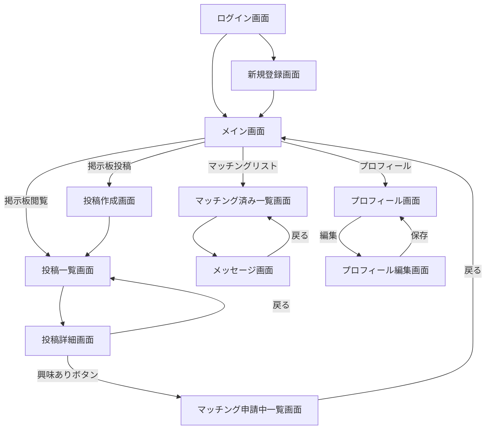
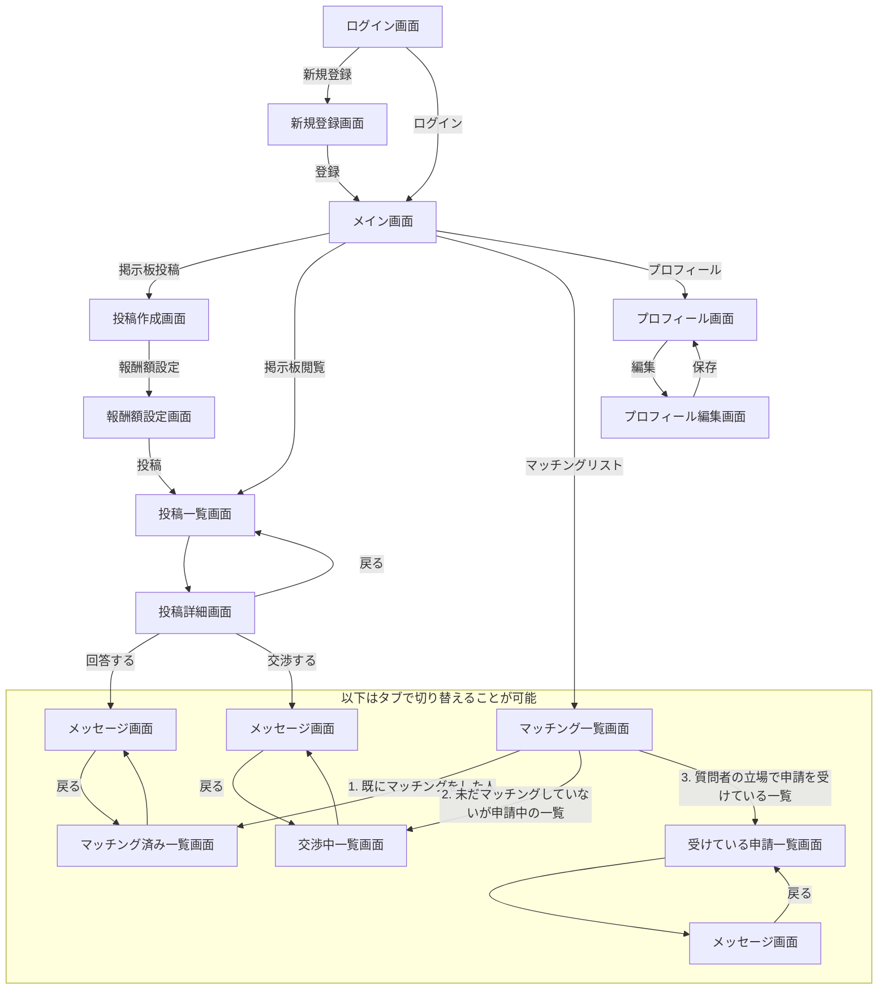
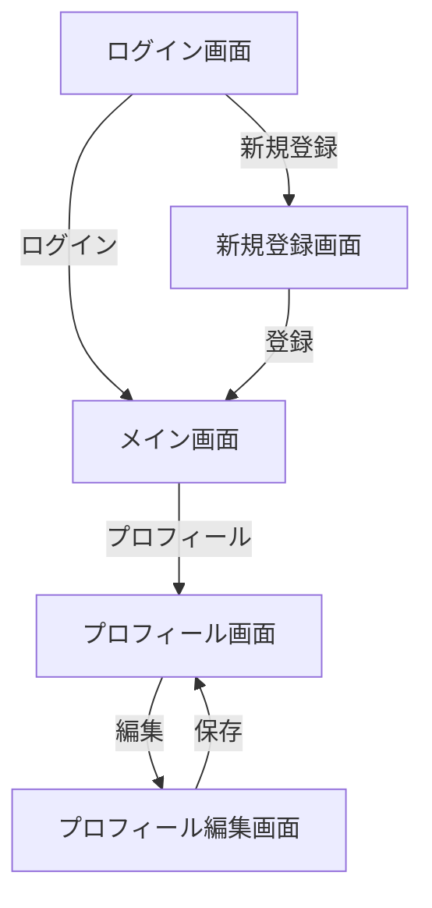
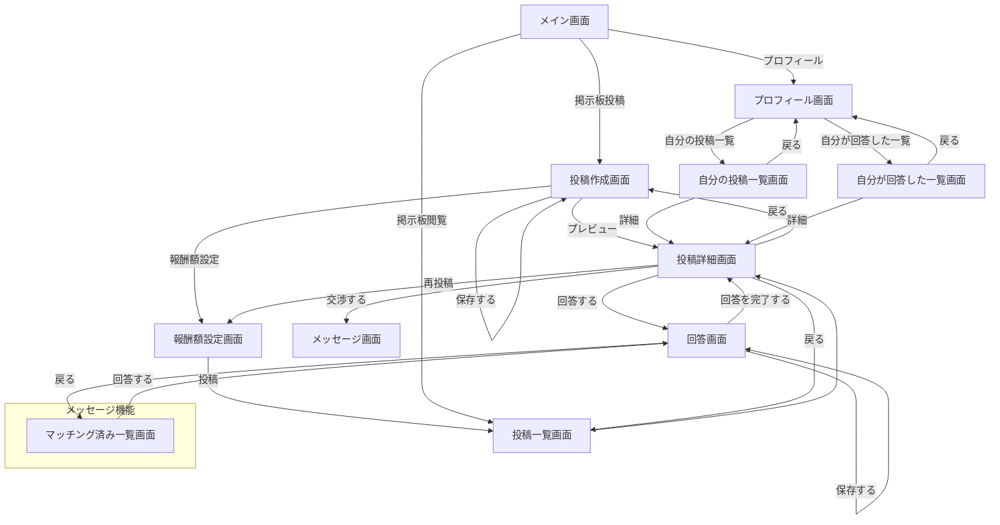
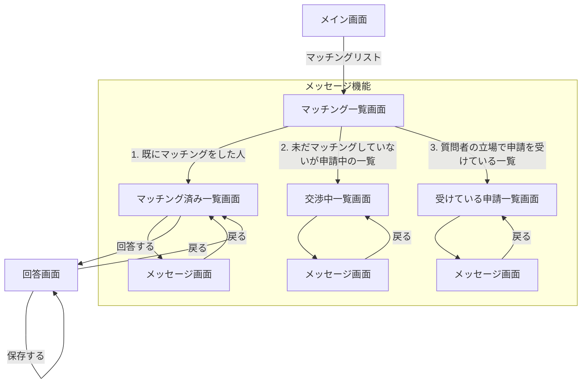

## ユースケース（最小限）

ユースケースとして、マッチングをすることのみに特化した最小限の機能です。

-   ロールとしては「質問者」と「回答者」が居ますが、両者はどちらにでも成りうるため、明確に区別はされません。
-   投稿した質問にはステータスが有り、「回答待ち（回答者が居ない）」、「回答中（回答者とマッチング済み）」、「回答済み（回答完了、マッチング完了）」となります。
-   掲示板に質問が有ります。質問者は、掲示板に投稿する形で質問を投げます。
-   質問に回答をする人は、掲示板から投稿一覧を確認することで、「興味あり」を送信することができます。
-   マッチング済み一覧画面では、「申請済み」、「申請をされた」、「マッチング済み」のステータスに応じた一覧を確認できます。マッチング済みであれば、メッセージが遅れます。
-   自分のプロフィールを修正することができます。
-   ログイン／新規登録からメイン画面への流れは割愛します。

## ユースケース（課金の追加）

最小限のユースケースに課金の仕組みを追加しました。課金の発生するユースケースは以下の通りです。

-   質問者は、質問を作成する時点で報酬額を設定します。
-   回答者は、投稿詳細から「興味あり」とした場合、交渉中の一覧に追加されます。
-   交渉中の一覧では、金額の交渉をします。（交渉削っても良いかも？）

## ユースケース（再回答の募集）

ここまでのユースケースでは、1件の質問に対して1人の回答者がマッチし、回答して金銭が発生することでその質問はクローズしてしまいます。
更に公募し、再度質問を投げる仕組みを追加すると以下のようになります。

-   自分の質問した質問の一覧が見れる。
    -   この一覧から、再度質問を募集することが可能。
-   自分の回答した質問の一覧が見れる。

-   （悩み中）
    -   メルカリの金額交渉のように、オープンなスペースで交渉する
    -   privateなスペースで、メッセージで交渉するか
    -   もしくは交渉機能自体削るか

#### プロフィール編集機能

#### 掲示板投稿機能

#### メッセージ機能

